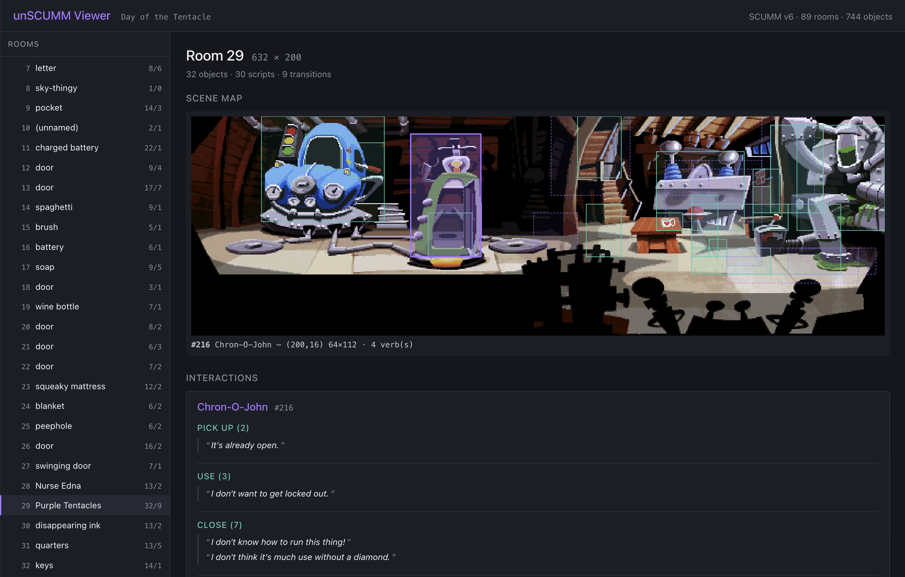

# unSCUMM

A SCUMM reverse-engineering project for extracting scene topology, inventory provenance, and puzzle logic.



## Goal

Build a reproducible analysis pipeline that converts SCUMM game files into:

- scene/room connectivity graphs
- inventory item locations and ownership flows
- verb-object interaction matrices
- puzzle unlock conditions and dependency trees
- narrative arcs, decision branches, and outcomes

## Repository Structure

- `src/scumm_deconstruct/` — library code for parsing SCUMM data and building analysis graphs
- `scripts/` — orchestration scripts (asset extraction, per-game builds)
- `games/<id>/` — raw game files (one directory per game)
- `data/<id>/` — derived analysis artifacts per game (e.g. `parsed.json`)
- `viewer/` — React + Vite web app for visualising the analysis
- `docs/` — analysis notes, game deconstructions, and project planning

## Quick Start

### 1. Install dependencies

Python:

```bash
python -m pip install -r requirements.txt
# nutcracker has a Cython 3 build issue; pin first if installing from scratch:
pip install 'cython<3'
pip install nutcracker
```

Viewer:

```bash
cd viewer
npm install
```

### 2. Place a game under `games/<id>/`

Each game lives in its own subdirectory, containing the raw SCUMM files. For example:

```
games/day_of_the_tentacle/
  TENTACLE.000
  TENTACLE.001
```

### 3. Build the analysis artifacts for a game

`scripts/build_game.py` is the one-stop orchestrator. It parses the game, extracts room backgrounds, and registers the game in the viewer's manifest.

```bash
python scripts/build_game.py \
    --id day_of_the_tentacle \
    --title "Day of the Tentacle" \
    --scumm-version 6 \
    --index games/day_of_the_tentacle/TENTACLE.000 \
    --data  games/day_of_the_tentacle/TENTACLE.001
```

This produces:

- `data/<id>/parsed.json` — parsed rooms, objects, scripts, transitions, per-verb interactions, verb-name map
- `viewer/public/games/<id>/rooms/room_N.png` — extracted room backgrounds
- `viewer/public/games/<id>/objects/obj_N_S.png` — extracted object sprites (one per state variant)
- `viewer/public/games/<id>/parsed.json` — symlink into the viewer's public tree
- `viewer/public/games.json` — upserted manifest entry

Pass `--skip-backgrounds` when iterating on the parser to skip the slow nutcracker extraction (backgrounds + sprites).

Re-running the same command overwrites cleanly; adding a new game just means another invocation with a different `--id`.

### 4. Run the viewer

```bash
cd viewer
npm run dev
```

The viewer loads `games.json`, presents a game selector when more than one game is registered, and offers four views (toggled in the header):

- **Rooms** — scene map with object hit zones overlaid on the real game art; click an object to see its verbs, dialogue, effects, and preconditions
- **Items** — for every object picked up or checked anywhere, cross-references to every script that acquires it, requires it, or changes its state
- **Verbs** — for every verb id seen in scripts, effect-type breakdown, sample dialogue, and a filterable list of all its implementations across objects
- **Graph** — force-directed scene graph coloured by node category (hub / terminal / dead-end / orphan). Click a node to open a side panel with the room's thumbnail, metadata, exits, and a "open in Rooms view" button.

All views are deep-linkable: `/games/<id>/rooms/<n>`, `/games/<id>/items/<n>`, `/games/<id>/verbs/<n>`, `/games/<id>/graph/<n>` — back/forward browser buttons work and document titles reflect the current selection.

## CLI (parser only)

If you just want the parsed JSON without the viewer artifacts:

```bash
python -m scumm_deconstruct \
    --index games/day_of_the_tentacle/TENTACLE.000 \
    --data  games/day_of_the_tentacle/TENTACLE.001 \
    --output data/day_of_the_tentacle/parsed.json \
    --summary --show-graph
```

## Current status

**Parser / analyser**

- ✅ SCUMM v6 chunk parsing (rooms, objects, verb tables, scripts)
- ✅ v6 bytecode analyser with symbolic stack model
  - room transitions (`loadRoom`, `loadRoomWithEgo`)
  - inline dialogue / narration (print & talk opcodes, handling 0xFF/0xFE escapes)
  - effects (`pickupObject`, `setState`, `setOwner`, `startScript`, `startObject`)
  - preconditions (`owns(obj)`, `state(obj) == N`, `classOfIs`)
- ✅ Per-verb interaction extraction (dialogue + effects + preconditions per verb on every object)
- ✅ Verb-name extraction from `verbOps SO_VERB_INIT` + `SO_VERB_NAME`, aggregated game-wide
- ✅ Font-ligature substitution (DOTT's 0xB0="oo", 0xB8="ll" render as real text)

**Asset extraction**

- ✅ Per-room backgrounds via nutcracker (one PNG per room)
- ✅ Per-object sprites via nutcracker (one PNG per object × state variant)

**Viewer**

- ✅ Rooms view — scene map with hit-zone overlays, per-object interactions panel, clickable exits, object sprite thumbnails
- ✅ Items view — cross-references (acquired-in / required-by / state-changed-at) derived from the script analysis
- ✅ Verbs view — verb-object interaction matrix with effect breakdown, sample dialogue, filterable implementation list
- ✅ Graph view — force-directed scene graph with node categorisation (hub / terminal-candidate / dead-end / orphan) and side panel
- ✅ Deep-linkable URLs + browser back/forward, smart synthesised room labels (frequency-based), multi-game manifest

**Not done / on deck**

- ⬜ Cross-room item dependency *graph* (today: list-based cross-refs in Items view; next: a visual puzzle-flow graph)
- ⬜ CHAR font resource parsing (today: hand-curated 2-entry ligature map)
- ⬜ Walkbox overlays on the scene map
- ⬜ Multi-state sprite preview tied to `setState` effects
- ⬜ Validation against a second SCUMM game (MI2 / Sam & Max) to surface format differences

**Measured against Day of the Tentacle** (SCUMM v6):

| Extraction | Count |
|---|---:|
| Rooms | 89 |
| Objects | 744 |
| Room transitions | 137 |
| Named verbs (from `verbOps`) | 16 |
| Distinct verb ids used on objects | 57 |
| Per-verb implementations | 2,500+ |
| Dialogue lines | 2,568 |
| Object-state effects | 1,301 |
| Inventory / state preconditions | 204 |
| Room background PNGs | 89 |
| Object sprites | 645 |
